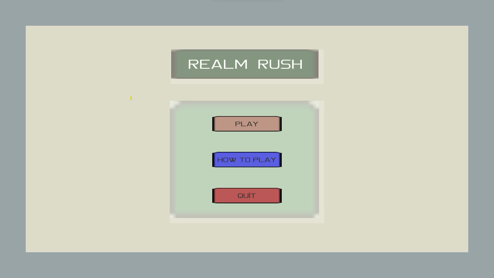
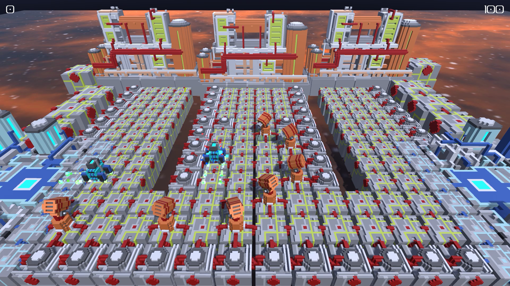
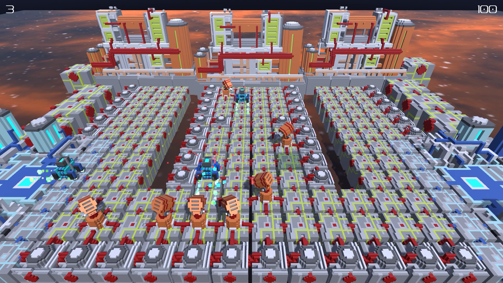
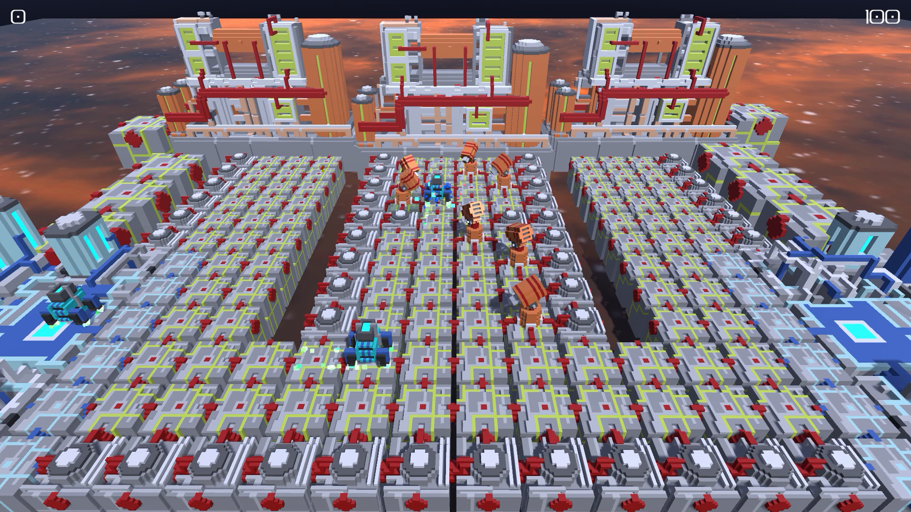
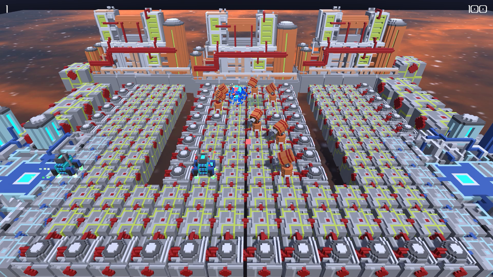
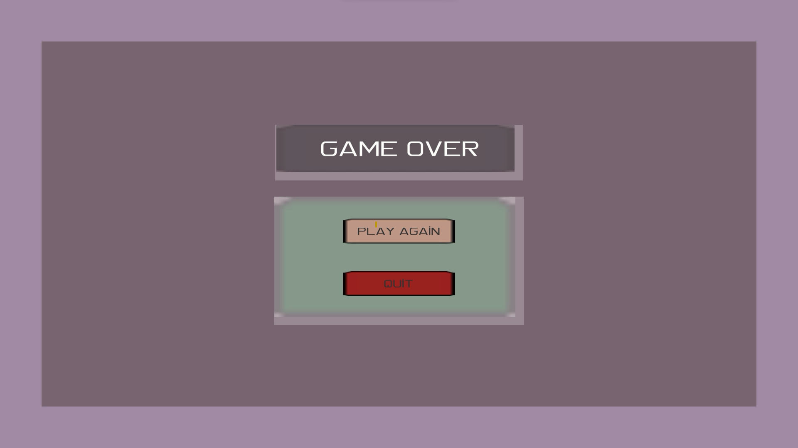

# Realm-Rush

### Introduction
    Realm Rush is a tower defense game in which players aim to protect their territory by preventing enemies
    from reaching their base. Limited towers can be strategically placed on a grid to target and stop incoming
    enemies, ensuring the player's base remains secure.

### Features
    - Placement of up to 7 towers on the grid.
    - Placable blocks (waypoints) change to green when a tower can be placed on the grid, turning red if not 
      placable.
    - Intelligent AI finds the shortest path from the starting point(enemy base) to the destination(player base).
      enemies spawn from the enemy base at fixed intervals and move toward the player's base.
    - Towers automatically target the nearest enemy.
    - Spacious vibes and immersive sound effects.
    
### Screenshots

   
   
   
   
   
   

   
### Implementation and Game Design
#### Implementation
    - PathFinder: Responsible for finding the shortest path on the grid using the breadth-first search algorithm 
                  implemented using data sturctures like dictionary and a queue.
    
    - TowerFactory: Responsible for limiting the instantiation of towers to a maximum of 7 and reusing already 
                  spawned towers for performance using the queue.
                  
    - Tower: Responsible for finding the nearest enemy and targeting them. After destroying the targeted enemy, 
                  it selects the next nearest one.
             
    - EnemySpawner: Spawns enemies at fixed intervals.
    
    - EnemyMovement: Obtains the shortest path from the PathFinder and follows it.
    
    - EnemyDamage: Manages hit processing and destruction of enemies.
    
    - GameManager: Responsible for managing game states, such as running, pausing, or activating the game over 
                   screen if the player is defeated.
                   
    - Cube Editor: An editor script for placing grid blocks (waypoints) only at integer coordinates, crucial for 
                   pathfinding, as it relies on integer coordinates.

 
 #### Game Design
     - Designed strategic level independently using provided assets.
     - Implemented an editor script(CubeEditor) to facilitate the placement of blocks (waypoints) with restricted 
       integer coordinates.
       
#### Focus
    - Learning Custom pathfinding for analog grid based world.
    - Get famalier with using data structures like dictionaries, lists.
    
### Gameplay Demonstration
    For a visual demonstration of the gameplay, watch video on YouTube.
 [Youtube Video Link](https://youtu.be/cmyqPkxtXsE)

### Play the Game
    To experience the game firsthand, play it directly by following this playable link.
[Play in browser(WebGl)](https://rahul-pargi.itch.io/realm-rush)
